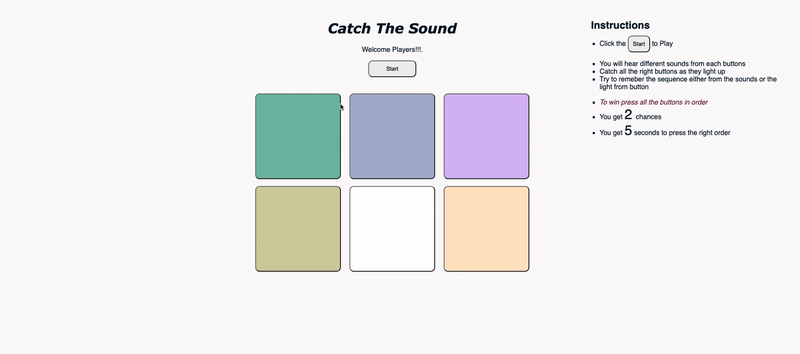
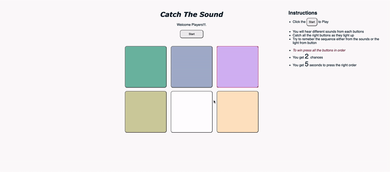

# CatchTheSound

Catch The Sound is a light and memory game. The game starts with a combination of light and sound, and adds up a sequence after each turn. 
The purpose of this game is to make players remeber and take action quickly. 

- After the player starts the game
- A sequence is played
- On each turn player gets 5 sec to hit the sequence played by the computer
- To win the Game player needs to hit all the sequence presented at each turn

## Game Walkthrough


---

---


## Site
https://catch-my-sound.glitch.me


If you used any outside resources to help complete your submission (websites, books, people, etc) list them here.
## Resources Used
- Stack Overflow 
- https://css-tricks.com/

## Challenges
The challenge for this submission was the bugs you would get while working on the main logic of the game. When I was writing the script for the main logic of this game, some of the functions were not working as expected. For example, the sound of the game was not working and to make it work I had to add this code. It is another way to implement Web Audio context. For some reasons the given code was not working so I changed it to this code. 
```javascript=
var contextClass = (window.AudioContext || 
    window.webkitAudioContext || 
    window.mozAudioContext || 
    window.oAudioContext || 
    window.msAudioContext);
```
I was having difficulty in implementing the lighting up button code. To learn about what each selectors do and understand them I watched a youtube video and it make clear to me. I found that we were using combination of identifier and javascript to manipulate the lightning. 

The main logic of the game was written in a single code file so it became to track of what I was doing. So I wrote down comments in order for me to later know what I was doing within that function. 

## Questions
- My biggest question would be how would a professional web developer manages the code written in the script file. Larger project has so many lines of codes and is there an architecutre for effectively writing code in JavaScript. 
- Is there a standard way to write down HTML and CSS. 
- How is testing done? 
- Web development is a broad field, it has so many components. What kind of challenges would developer face? 

## Future Improvements
- Make it responsive and mobile friendly
- add a top score list and compare it to your previous score
- make code more readable by writing helper functions
    - take out the code in nested if statements and write a functions for that 
- use arrow functions
- everything is in a single file, made different files and learn to make modules for the functions 

## My Five Minute Interview Recording

